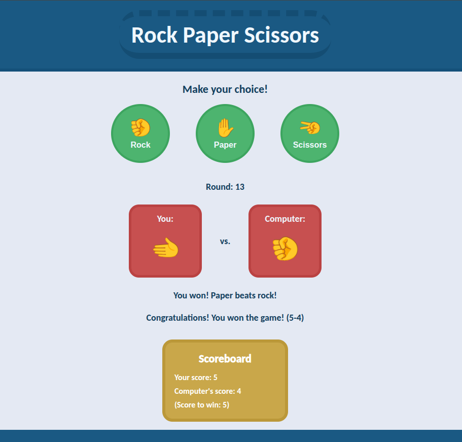

# Rock Paper Scissors

## Description

HTML + CSS + JavaScript project.

It's a Rock Paper Scissors game with UI, where the player plays against the computer.

This was my first practical project using JavaScript. This time, the focus was not on the interface itself, but on learning the language that will be the basis for the back-end of larger projects.

## Live Demo

**[Click here](https://pedroasb.github.io/rock-paper-scissors/)** to try out this project on browser.

## Screenshots

## About the Project

This project is part of the curriculum of [The Odin Project](https://www.theodinproject.com/). You can check out other projects that I've built in my [fullstack-journey](https://github.com/PedroASB/fullstack-journey) repository.

**Note:** this project was originally part of a multi-project repository and was later split into its own repository. A git history filtering tool was used to preserve the original commit history.
